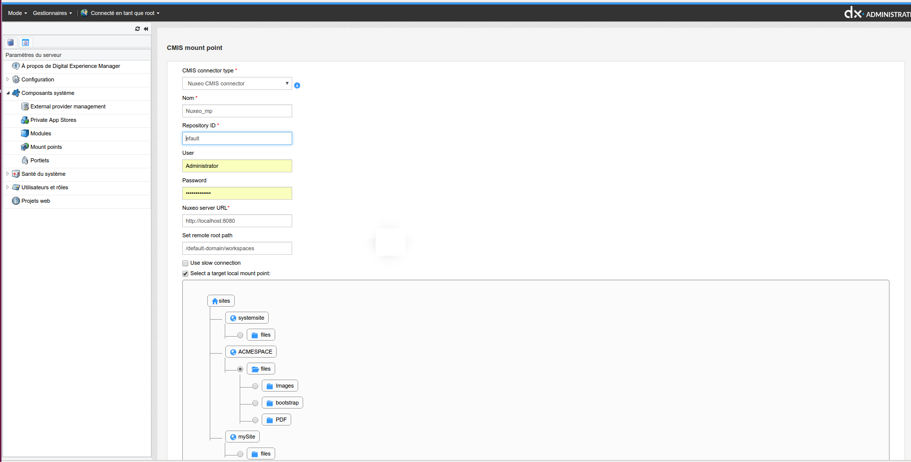

# Portal factory - CMIS provider module

## Overview

### CMIS

Content Management Interoperability Services (CMIS) is an open standard that allows different content management systems to inter-operate over the Internet.
Specifically, CMIS defines an abstraction layer for controlling diverse document management systems and repositories using web protocols.

CMIS defines a domain model plus bindings that can be used by applications.
OASIS, a web standards consortium, approved CMIS as an OASIS Specification on May 1, 2010.
CMIS 1.1 has been approved as an OASIS specification on December 12, 2012.

CMIS provides a common data model covering typed files and folders with generic properties that can be set or read.
There is a set of services for adding and retrieving documents ('objects').
There may be an access control system, a checkout and version control facility, and the ability to define generic relations.
Three protocol bindings are defined, one using WSDL and SOAP, another using AtomPub,[4] and a last browser-friendly one using JSON.
The model is based on common architectures of document management systems.

### Goals

The goals of this project are as follows:

 - Integrate CMIS supported repository.
 - Implement full CRUD support.
 - Implement Search as full as possible.

### Supported features

1. 2 base CMIS types (document and folder) and custom types inherited from them are supported.
2. Full support CRUD, rename, move for supported types. It is possible to modify content and properties values.
3. Both path and id identification are supported by external provider.
4. Ordering is not supported, for CMIS does not support such feature.
5. Searchable is supported  with restrictions (see TestQuery.txt for demo queries).
    - Join is not implemented. We return only one node path per row.
    - lower, upper, length, score - are not supported.
    - not mapped properties acts as null.
    - any specific behaviour for multivalue properties is not implemented.
    - date type is supported only if cast expression is used (no auto converting).
6. Configurable mapping for custom types.

CMIS not supports languages attribute, so if Jahia will add language restrictions there will be not mapped property in CMIS queries.

#### Nuxeo connection feature

##### Prerequisite
The Nuxeo CMIS connection is implemented for Nuxeo cap LTS 2015 (7.10)
In order to test this connection you will need to know the URL, User and password to connect to this server

##### Nuxeo Mount point initiation
To create a Nuxeo mount point using the CMIS standard, a new connector type has been created in this module.
The "CMIS connector type" in the mount point creation form can now be filled with "Nuxeo CMIS connector".

By default the repository used to connect to Nuxeo through CMIS is "default".

The remote path has to be filled normally for example "/default-domain/workspaces"



For more information on the Nuxeo CMIS implementation please refer to the following documentation :
https://doc.nuxeo.com/display/NXDOC/CMIS

#### Nuxeo mount point limitations
In the case of Nuxeo mount points the move, copy and rename operations are not supported due to Nuxeo path management.

#### The images management
The images are mapped adding the image mixin and their exif properties are also mapped.
If an image has at least one exif property set, then the exif mixin will also be added to it.

### Implementation tips

As implementation CMIS protocol used Apache Chemistry.
In default configuration module mounted at /external-cmis-mapped.
To map CMIS types on JCR we use cmis:folder and cmis:document. Common properties separate in cmis:base mixin.

If we need to map some custom CMIS type we will need to extend cmis:folder or cmis:document.
Mapping for this type must be configured in spring. CmisTypeMapping support inheritance, so no property mapping duplication will need.

---

## Configuration

Jahia CMIS datasource is full configurable with spring config using special CmisConfiguration bean.
CmisConfiguration bean has 2 properties:
 - repositoryProperties - map of connection related configuration properties.
 By default, repositoryProperties are configured for usage of general jahia.properties
 - typeMapping - list of CmisTypeMapping beans. There are 2 base mappings: for cmis:document and cmis:folder.

### Mapping configuration

CMIS - JCR mapping is configurable with spring configuration files.
For each JCR type there must be CmisTypeMapping bean. Each CmisTypeMapping may have list of property mappings.
Each property may support 3 modes ( "mode" ) - rwc. R - read , W - write (update), C - property will be set on creation. By default property has only read mode.

#### Property mapping example

```
<bean class="org.jahia.modules.external.cmis.CmisTypeMapping" id="cmis_document" p:jcrName="cmis:document" p:cmisName="cmis:document">
    <property name="properties">
        <list >
            <bean p:cmisName="cmis:createdBy" p:jcrName="jcr:createdBy" class="org.jahia.modules.external.cmis.CmisPropertyMapping" />
            <bean p:cmisName="cmis:description" p:jcrName="cmis:description" class="org.jahia.modules.external.cmis.CmisPropertyMapping" p:mode="rwc" />
            <bean p:cmisName="cmis:contentStreamFileName" p:jcrName="cmis:contentStreamFileName" class="org.jahia.modules.external.cmis.CmisPropertyMapping" p:mode="rw"/>
        </list>
    </property>
</bean>
```

**This fragment is not real mapping example. We use it for documentation purposes. **

In this fragment we map CMIS *cmis:createdBy* property on JCR *jcr:createdBy* property as read only.
In the next line *cmis:description* is mapped  as JCR property with the same name in read, create and write modes.
In the next line *cmis:contentStreamFileName* is mapped as JCR property with the same name in read and write modes. For this property create mode is not set.
it means you can't set value for this property on node creation, but it can be updated later.
If the create mode is set without write mode, it is possible to set property value on creation, but it can not be updated later.


CmisTypeMapping beans may be organized in trees to support inheritance.
Child been will inherit all parent attribute mappings. Local attribute mapping will override inherited.
Inheritance may be configured in two ways:
- by using children property with list of embedded beans;
- by using separate beans linked by parent property.

#### Example 1
```
<property name="typeMapping">
    <list>
    <bean class="org.jahia.modules.external.cmis.CmisTypeMapping" id="cmis_document" p:jcrName="cmis:document"  p:cmisName="cmis:document">
        <property name="children">
            <list>
                <bean class="org.jahia.modules.external.cmis.CmisTypeMapping" p:jcrName="cmis:image" p:cmisName="cmis:image">
                </bean>
            </list>
        </property>
    </bean>
    </list>
</property>
```

#### Example 2
```
<property name="typeMapping">
    <list>
    <bean class="org.jahia.modules.external.cmis.CmisTypeMapping" id="cmis_document" p:jcrName="cmis:document"  p:cmisName="cmis:document">
    </bean>
    <bean class="org.jahia.modules.external.cmis.CmisTypeMapping" p:jcrName="cmis:image" p:cmisName="cmis:image">
        <property name="parent" ref="cmis_document"/>
    </bean>
    </list>
</property>
```
First way is more visual.
Second way is more flexible. You can inherit mappings even from other modules. **Don't forget to include parent bean in typeMapping list, too.**

---

## GraphQL 

GraphQL API endpoints are available for creating and modifying CMIS mount point nodes, in addition to mount point API operations already 
provided by external-provider module:

- addCmis

```
addCmis
Create a standard CMIS connector mount point.
Mount point node will be set to waiting status if CMIS connection cannot be established.

Type
String
Arguments
name: String!
Name for the mount point

mountPointRefPath: String
Target local mount point

rootPath: String
CMIS remote root path

cmisType: GqlCmisType!
CMIS mount point type

repositoryId: String
Repository ID (only for CMIS and Nuxeo connectors)

user: String
CMIS repository user

password: String
CMIS repository password

url: String!
CMIS endpoint URL

publicUser: String
Alfresco user used to access public content (it must not be guest)

ttLive: Int
Amount of seconds documents are cached (default: 900)

ttIdle: Int
Amount of seconds documents will stay in cache if not accessed (default: 300)

maxNumDocs: Int
Max number of documents/folder to read from any given path (default: 0 means read everything)

maxItemsPerBatch: Int
Max number of items to bring from the backend server per request (default: 1000)

useSlowConn: Boolean
Use slow connection (default: false)
```

- modifyCmis

```
modifyCmis
Modify an existing mount point node. Use empty string to remove property, unless otherwise specified

Type
Boolean
Arguments
pathOrId: String!
Mount point path or ID to modify

name: String
Name for the mount point

mountPointRefPath: String
Target local mount point

rootPath: String
CMIS remote root path

cmisType: GqlCmisType
CMIS mount point type

repositoryId: String
Repository ID (for standard and Nuxeo CMIS connector)

user: String
Repository user; cannot be deleted, only changed

password: String
Repository password; cannot be deleted, only changed

url: String
CMIS endpoint URL

publicUser: String
Username used to access public content (it must not be guest)

ttLive: Int
Amount of seconds documents are cached (default: 900)

ttIdle: Int
Amount of seconds documents will stay in cache if not accessed (default: 300)

maxNumDocs: Int
Max number of documents/folder to read from any given path (default: 0 means read everything)

maxItemsPerBatch: Int
Max number of items to bring from the backend server per request (default: 1000)

useSlowConn: Boolean
Use slow connection (default: false)
```

- flushCache

```
flushCache
Flush CMIS cache

Type
Boolean
```
---

## Testing environment tips.

The easiest way to create test environment is to use *OpenCMIS InMemory Repository* https://chemistry.apache.org/java/developing/repositories/dev-repositories-inmemory.html
InMemory Repository can be deployed either in separate Tomcat or in the same as for Jahia. Separate Tomcat is preferable because webapp's startup order can not be configured.
In other case you must be sure you don't access mount point on startup.

*OpenCMIS Workbench* may be used as CMIS client.

All CRUD operations are accessible from Repository Manager.
For search testing JCR query tool can be used. JCR-SQL2 queries covering all implemented search functionality can be found in docs/TestQuery.txt.

### Testing environment installation.

1. Install Tomcat for CMIS
2. Unpack chemistry-opencmis-server-inmemory-xxx.war into tomcat/webapp/inmemory folder. Repository config file is inmemory\WEB-INF\classes\repository.properties.
 Default configuration is ok.
3. Deploy Jahia with Jahia CMIS module.
4. Start Jahia.
5. Go to Document manager, select Remote - Mount - CMIS provider
6. Fill in the form with these entries. Configure port, depending on your tomcat config.
```
repository id=A1
user=dummyuser
password=dummysecret
url=http://localhost:18080/inmemory/atom11
```

There will be CMIS repository mounted in /mounts

---

## TODO:
 - Renditions;
 - Use of standard Alfresco Tokenization service (instead of custom Impersonnalisation AMP to deploy)
 


